<h1 align="center">
  <br/>
  StudyFlow — AI Study Assistant
</h1>

<p align="center">
  An Android application that turns your study material into <strong>Summaries</strong>, <strong>Quizzes</strong>, and <strong>Flashcards</strong> using Google Gemini AI.
</p>

<p align="center">
  <a href="https://github.com/zakariaennaqui/Android-AI-Study-Assistant/releases/latest">
    
  </a>
  


  
  
  <a href="./AI_Study_Assistant_Presentation.pptx">
  
</a>
</p>

---

## Screenshots

<table>
  <tr>
    <td align="center"><br/><sub>Login</sub></td>
    <td align="center">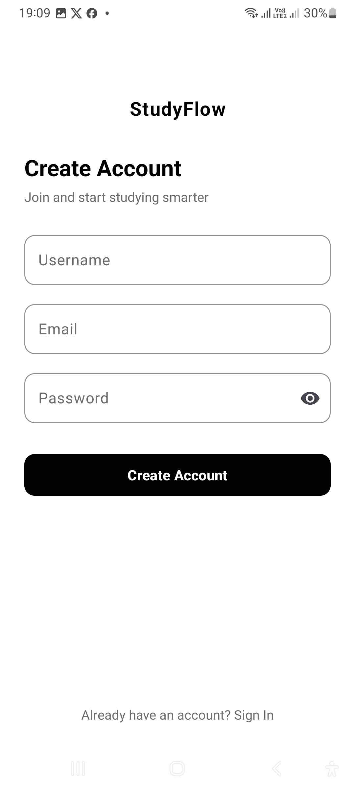<br/><sub>Register</sub></td>
    <td align="center">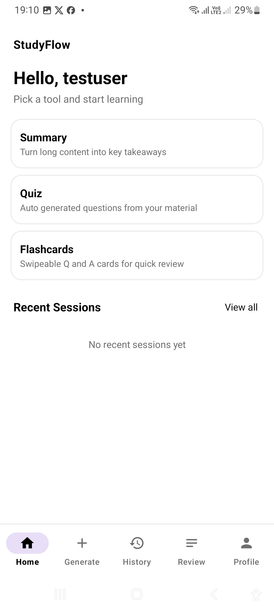<br/><sub>Home</sub></td>
    <td align="center">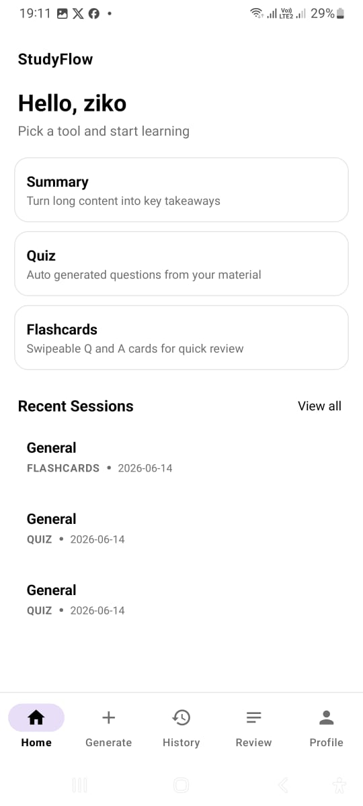<br/><sub>Home with sessions</sub></td>
  </tr>
  <tr>
    <td align="center">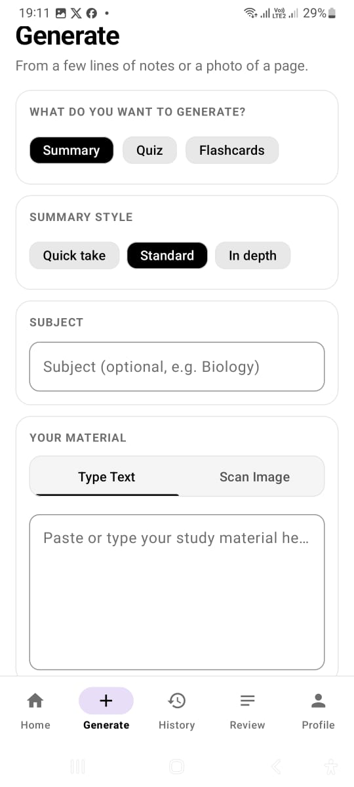<br/><sub>Generate (Text)</sub></td>
    <td align="center">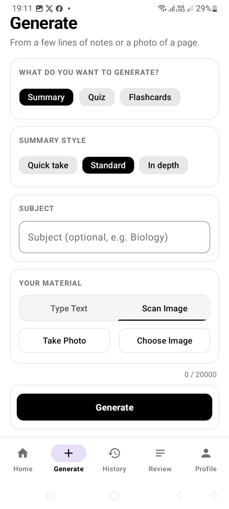<br/><sub>Generate (Scan)</sub></td>
    <td align="center">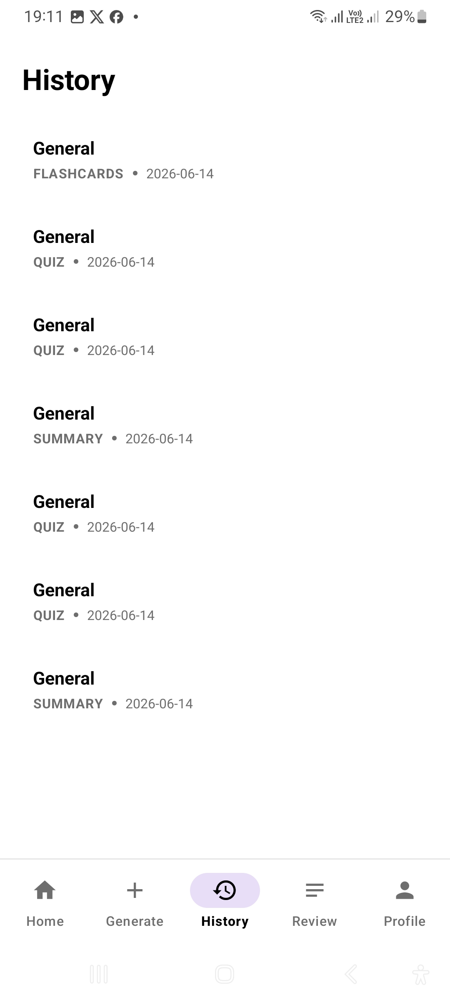<br/><sub>History</sub></td>
    <td align="center">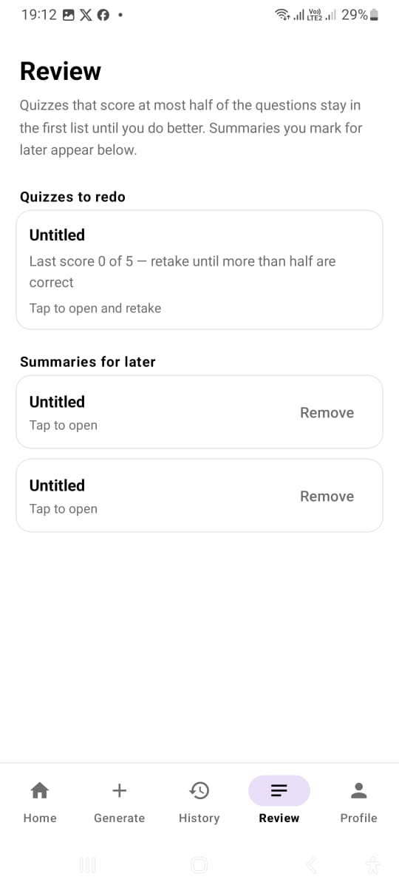<br/><sub>Review</sub></td>
  </tr>
  <tr>
    <td align="center">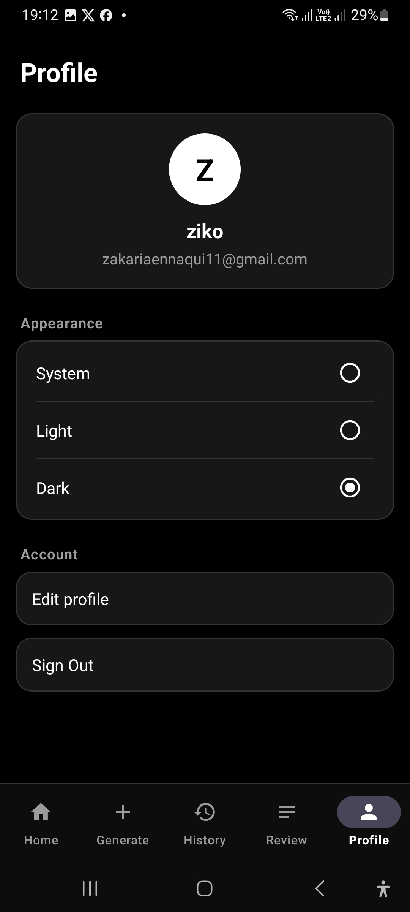<br/><sub>Profile (Dark)</sub></td>
    <td align="center">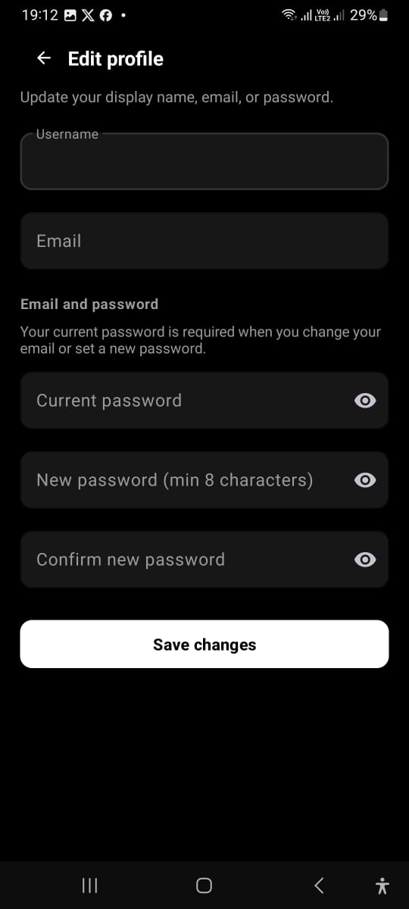<br/><sub>Edit Profile</sub></td>
  </tr>
</table>

---

## Features

| Feature | Description |
|---|---|
| **Summary** | Condense long notes into clear, structured key takeaways (Quick take / Standard / In depth) |
| **Quiz** | Auto-generate multiple-choice questions from your material |
| **Flashcards** | Swipeable Q&A cards for rapid review |
| **Scan Image** | Take a photo or pick from gallery — ML Kit OCR extracts the text automatically |
| **History** | Browse all your past study sessions |
| **Review** | Failed quizzes and saved summaries are queued for spaced repetition |
| **Dark / Light / System theme** | Appearance setting persisted per user |
| **Edit Profile** | Change username, email, or password at any time |

---

## Architecture

```
┌─────────────────────────────┐      HTTPS / JWT     ┌──────────────────────────────┐
│   Android App (StudyFlow)   │ ◄──────────────────► │  Spring Boot REST API        │
│                             │                      │  (Hugging Face Spaces)       │
│  • Java + MVVM              │                      │                              │
│  • Retrofit 2               │                      │  • Spring Boot 4 + Java 17   │
│  • ML Kit (OCR)             │                      │  • Spring Security + JWT     │
│  • Navigation Component     │                      │  • Google Gemini 2.0 Flash   │
│  • ViewBinding              │                      │  • Neon PostgreSQL (cloud)   │
└─────────────────────────────┘                      └──────────────────────────────┘
```

### Tech Stack

**Android (Frontend)**
- Java · Android SDK 34 · Min SDK 24 (Android 7.0+)
- Retrofit 2 + Gson · OkHttp
- ML Kit Text Recognition v2
- Navigation Component · ViewBinding · Material 3

**Backend**
- Spring Boot 4 · Java 17
- Spring Security · JJWT (JWT authentication)
- Spring Data JPA · Hibernate
- Google Gemini AI (`gemini-2.0-flash`)
- Neon PostgreSQL (serverless cloud DB)
- Docker (deployed on Hugging Face Spaces)

**CI/CD**
- GitHub Actions → builds & publishes APK to GitHub Releases automatically on every push

---

## Installation Guide (APK Sideload)

> The app is distributed as an APK (not yet on the Play Store). Follow these steps to install it on your Android device.

### Step 1 — Download the APK

Go to **[Releases](https://github.com/zakariaennaqui/Android-AI-Study-Assistant/releases/latest)** and download `AI-Study-Assistant-v1.0.apk` (~50 MB).

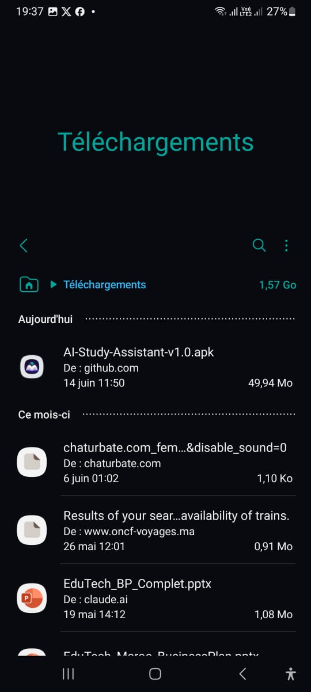

---

### Step 2 — Allow installation from unknown sources

Before installing, enable **"Install unknown apps"** for your browser or file manager:

> **Settings → Apps → [Your browser/Files app] → Install unknown apps → Allow**

---

### Step 3 — Open and install

Tap the downloaded APK in your file manager and press **"Install"**.

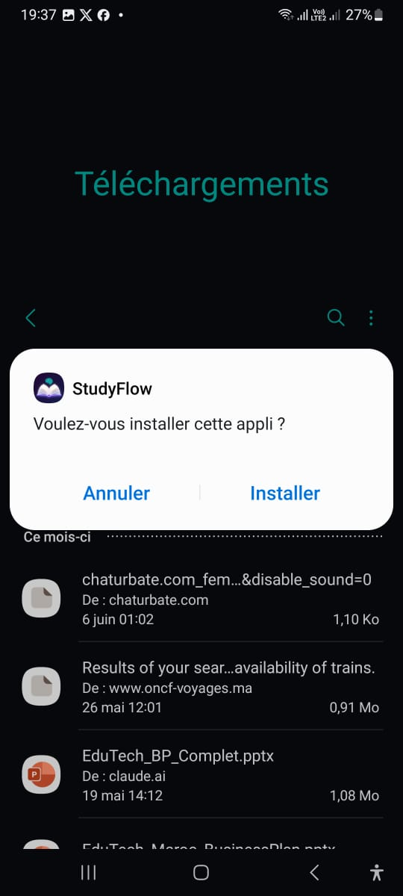

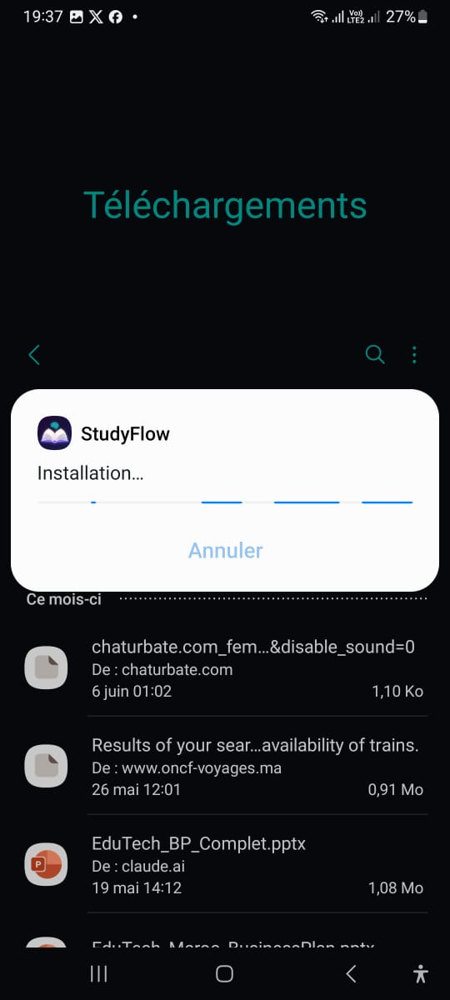

---

### Step 4 — Google Play Protect warning

You will see a Play Protect warning because the app is not yet on the Play Store.

> ✓ Tap **"Install anyway"** (the text link above the blue button)  
> ✕ Do **NOT** tap the blue **"OK"** button — that cancels the installation

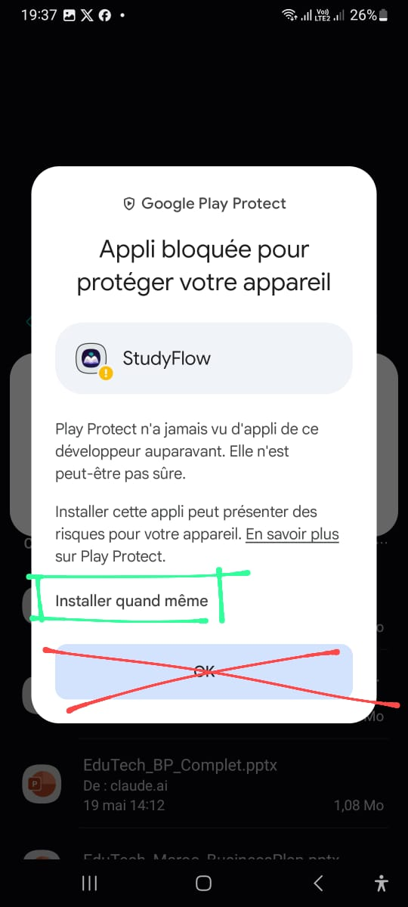

---

### Step 5 — Done!

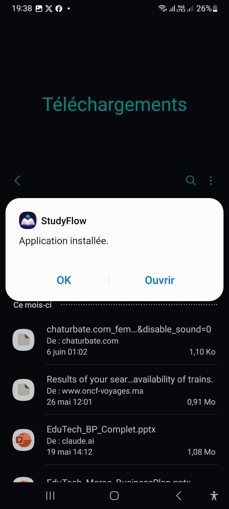

The **StudyFlow** icon will appear on your home screen.


---

## Backend Deployment

The backend is deployed for **free** using the following stack:

| Service | Provider | URL |
|---|---|---|
| REST API | Hugging Face Spaces (Docker) | `https://zakariaennaqui-ai-study-assistant-backend.hf.space` |
| Database | Neon.tech (serverless PostgreSQL) | Managed via env vars |
| AI | Google Gemini API (free tier) | `gemini-2.0-flash` |

### Environment Variables (HF Spaces → Settings → Variables and secrets)

```
DB_URL          = jdbc:postgresql://<neon-host>/<dbname>?sslmode=require
DB_USERNAME     = <neon-user>
DB_PASSWORD     = <neon-password>
GEMINI_API_KEY  = <your-google-ai-studio-key>
GEMINI_MODEL    = gemini-2.0-flash
JWT_SECRET      = <random-256-bit-hex>
```

### Re-deploying the backend

The backend is inside the `ai-study-assistant-backend/` folder and is built automatically by Hugging Face whenever you push to the linked repository. Alternatively:

```bash
cd ai-study-assistant-backend
docker build -t ai-study-assistant .
docker run -p 7860:7860 --env-file .env ai-study-assistant
```

---

## CI/CD — Automatic APK Build

Every push to `main` triggers a GitHub Actions workflow that:
1. Sets up JDK 21 and Android SDK 36
2. Runs `./gradlew assembleDebug`
3. Publishes the APK as a **GitHub Release**

Workflow file: [`.github/workflows/build-apk.yml`](.github/workflows/build-apk.yml)

---

## REST API Reference

**Base URL:** `https://zakariaennaqui-ai-study-assistant-backend.hf.space`

All endpoints except Auth require the header:
```
Authorization: Bearer <JWT_TOKEN>
```

### Auth

| Method | Endpoint | Auth | Description |
|---|---|---|---|
| `POST` | `/api/auth/register` | ✕ | Create account → returns JWT |
| `POST` | `/api/auth/login` | ✕ | Sign in → returns JWT |
| `GET` | `/api/auth/me` | ✓ | Get current user info |
| `PATCH` | `/api/auth/profile` | ✓ | Update username / email / password |

**Register / Login request:**
```json
{ "username": "ziko", "email": "ziko@mail.com", "password": "secret123" }
```

**Register / Login response:**
```json
{ "token": "eyJ...", "userId": "uuid", "username": "ziko" }
```

---

### Study Generation

| Method | Endpoint | Auth | Description |
|---|---|---|---|
| `POST` | `/api/study/generate` | ✓ | Generate Summary / Quiz / Flashcards |

**Request body:**
```json
{
  "text": "Photosynthesis is the process by which plants...",
  "type": "SUMMARY",
  "style": "STANDARD",
  "subject": "Biology"
}
```

`type` values: `SUMMARY` · `QUIZ` · `FLASHCARDS`  
`style` values: `QUICK` · `STANDARD` · `IN_DEPTH` *(only for SUMMARY)*

---

### History

| Method | Endpoint | Auth | Description |
|---|---|---|---|
| `GET` | `/api/history` | ✓ | List all study sessions |
| `GET` | `/api/history/{sessionId}` | ✓ | Get a single session |
| `DELETE` | `/api/history/{sessionId}` | ✓ | Delete a session |

---

## Local Development

### Prerequisites
- JDK 21+
- Android Studio Hedgehog+
- Docker (for backend)
- A Gemini API key from [aistudio.google.com](https://aistudio.google.com/apikey)

### Run the backend locally

```bash
cd ai-study-assistant-backend

# Create local env file
cat > .env << EOF
DB_URL=jdbc:postgresql://localhost:5432/aiassistant
DB_USERNAME=postgres
DB_PASSWORD=postgres
GEMINI_API_KEY=your_key_here
JWT_SECRET=your_256bit_hex_secret
EOF

# With Docker
docker build -t ai-study-assistant .
docker run -p 7860:7860 --env-file .env ai-study-assistant

# Or with Maven directly
./mvnw spring-boot:run
```

The API will be available at `http://localhost:7860`.

### Run the Android app

1. Open the project in Android Studio
2. In `app/build.gradle`, the `BASE_URL` build config field points to the production server. For local testing, pass it via Gradle:
   ```
   ./gradlew assembleDebug -PBASE_URL=http://10.0.2.2:7860/
   ```
3. Run on emulator or device (Min SDK 24 / Android 7.0)

---

## Presentation

A project presentation slide deck is available in the repository root:

[`AI_Study_Assistant_Presentation.pptx`](./AI_Study_Assistant_Presentation.pptx)

## Project Structure

```
Android-AI-Study-Assistant/
├── app/                                # Android application
│   └── src/main/java/.../
│       ├── ui/                         # Fragments & Activities
│       │   ├── auth/                   # Login, Register
│       │   ├── home/                   # Home dashboard
│       │   ├── generate/               # Content generation
│       │   ├── history/                # Study history
│       │   ├── review/                 # Spaced repetition
│       │   └── profile/                # Profile & settings
│       ├── network/                    # Retrofit API service
│       └── model/                      # Request/Response DTOs
├── ai-study-assistant-backend/         # Spring Boot REST API
│   └── src/main/java/.../
│       ├── auth/                       # Auth controller + service + DTOs
│       ├── study/                      # Study generation (Gemini)
│       ├── history/                    # Session history
│       ├── model/entities/             # JPA entities (User, StudySession)
│       ├── security/                   # JWT filter + service
│       └── config/                     # Spring Security config
├── images/                             # Screenshots
├── .github/workflows/build-apk.yml    # CI/CD pipeline
└── README.md
```
